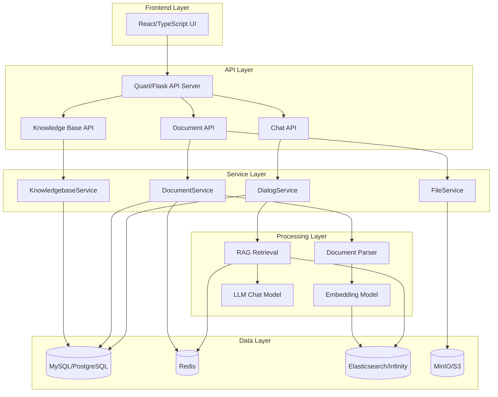
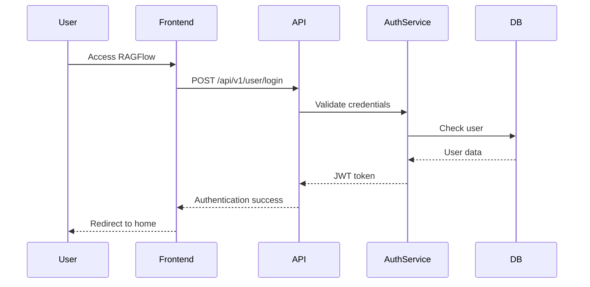
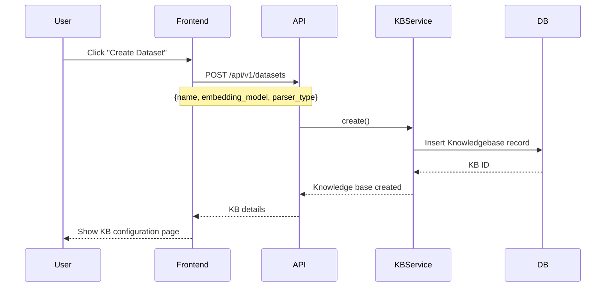
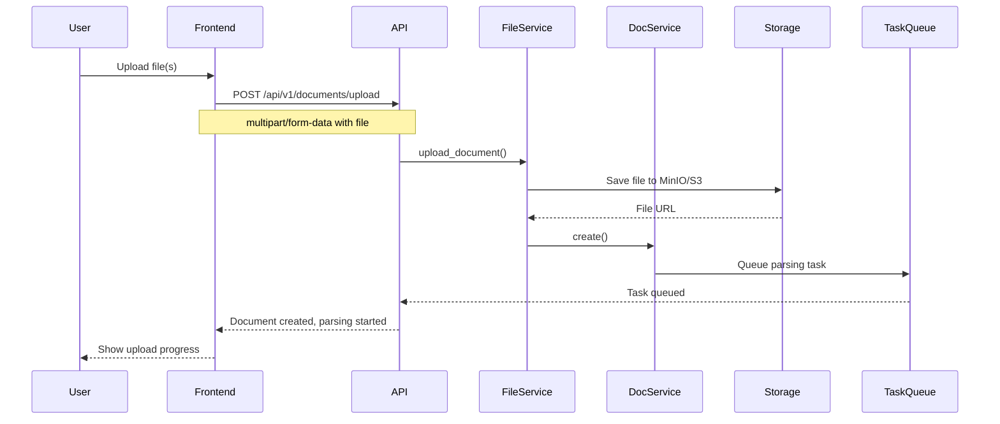
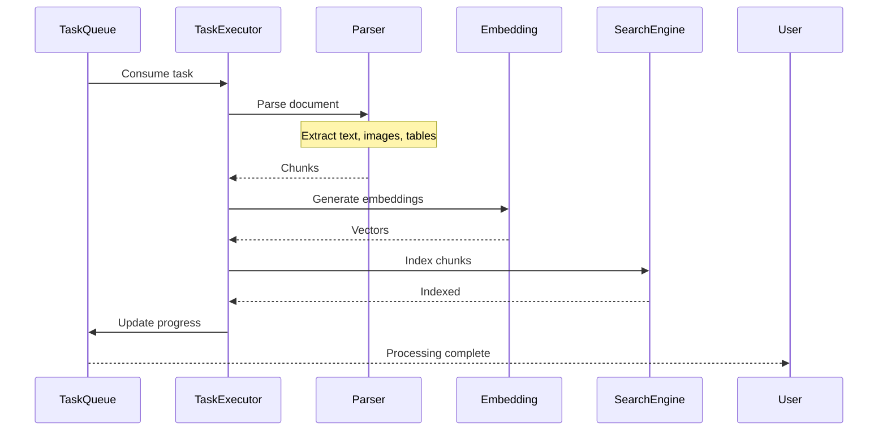
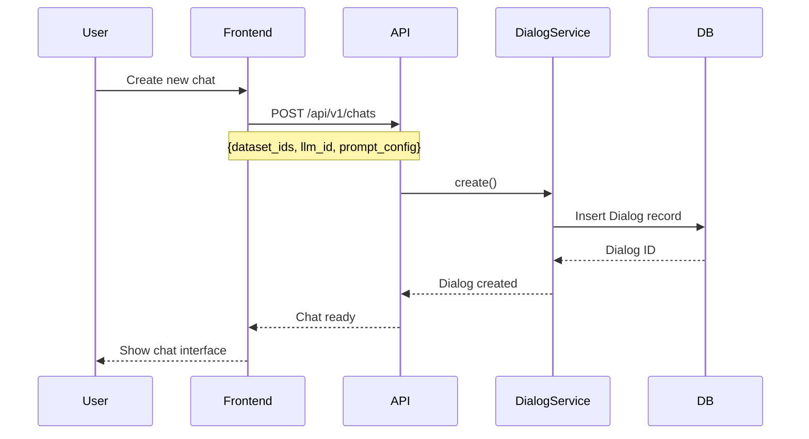
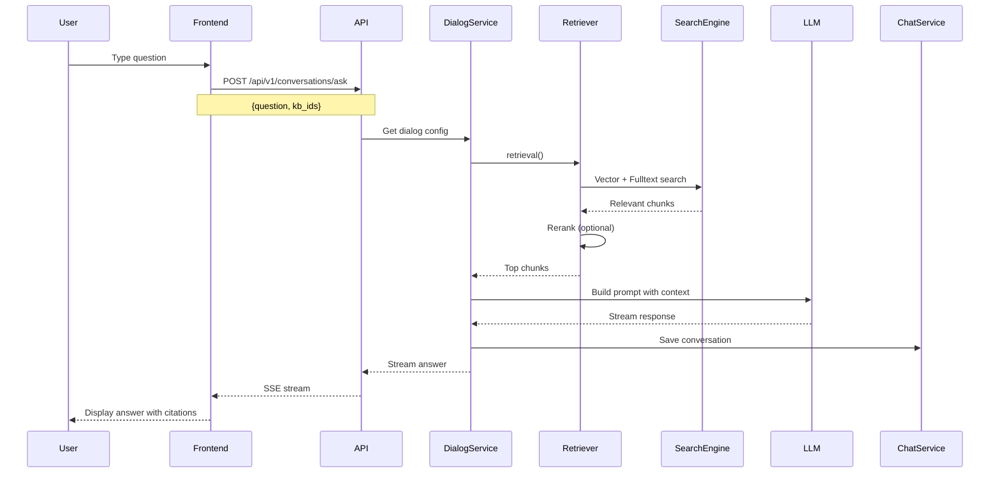
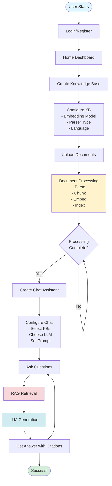

# RAGFlow Golden Path

## Overview

The golden path represents the ideal user journey through RAGFlow, from initial setup to getting AI-powered answers from your documents.

> **📊 Viewing Diagrams**: This document contains Mermaid diagrams. If they don't render in your preview:
> - Copy the Mermaid code and paste it into [Mermaid Live Editor](https://mermaid.live/)
> - Use the ASCII/text diagrams provided below each Mermaid diagram
> - View in GitHub/GitLab which have native Mermaid support

## System Architecture

> **💡 Tip**: If diagrams don't render, view them online at [Mermaid Live Editor](https://mermaid.live/) or use the ASCII diagrams below.



**ASCII Diagram:**
```
┌─────────────────────────────────────────────────────────┐
│              Frontend Layer (React/TypeScript)          │
└──────────────────────┬──────────────────────────────────┘
                       │
                       ▼
┌─────────────────────────────────────────────────────────┐
│              API Layer (Quart/Flask)                     │
│  ┌──────────────┐  ┌──────────────┐  ┌──────────────┐  │
│  │  KB API      │  │  DOC API    │  │  CHAT API    │  │
│  └──────┬───────┘  └──────┬───────┘  └──────┬───────┘  │
└─────────┼─────────────────┼──────────────────┼──────────┘
          │                 │                  │
          ▼                 ▼                  ▼
┌─────────────────────────────────────────────────────────┐
│              Service Layer                               │
│  ┌──────────────┐  ┌──────────────┐  ┌──────────────┐  │
│  │ KB Service   │  │ DOC Service  │  │ CHAT Service │  │
│  └──────┬───────┘  └──────┬───────┘  └──────┬───────┘  │
└─────────┼─────────────────┼──────────────────┼──────────┘
          │                 │                  │
          ▼                 ▼                  ▼
┌─────────────────────────────────────────────────────────┐
│              Processing Layer                            │
│  ┌──────────────┐  ┌──────────────┐  ┌──────────────┐  │
│  │   Parser     │  │  Embedding   │  │  RAG/LLM     │  │
│  └──────┬───────┘  └──────┬───────┘  └──────┬───────┘  │
└─────────┼─────────────────┼──────────────────┼──────────┘
          │                 │                  │
          ▼                 ▼                  ▼
┌─────────────────────────────────────────────────────────┐
│              Data Layer                                  │
│  ┌──────────────┐  ┌──────────────┐  ┌──────────────┐  │
│  │   MySQL      │  │ Elasticsearch│  │  MinIO/S3    │  │
│  │   Redis      │  │              │  │              │  │
│  └──────────────┘  └──────────────┘  └──────────────┘  │
└─────────────────────────────────────────────────────────┘
```

## Golden Path Flow

### Step 1: User Authentication



**Flow:**
```
User → Frontend → API → AuthService → Database
                                    ↓
User ← Frontend ← API ← AuthService ← (JWT Token)
```

**Key Endpoints:**
- `POST /api/v1/user/login` - User login
- `POST /api/v1/user/register` - User registration

### Step 2: Create Knowledge Base



**Flow:**
```
User clicks "Create Dataset"
    ↓
Frontend sends: {name, embedding_model, parser_type}
    ↓
API → KBService → Database (creates KB record)
    ↓
Returns KB ID → Frontend → User sees configuration page
```

**Key Endpoints:**
- `POST /api/v1/datasets` - Create knowledge base
- `GET /api/v1/datasets/:id` - Get KB details

**Configuration Required:**
- **Embedding Model**: Converts text to vectors (e.g., `bge-large-en-v1.5`)
- **Parser Type**: Chunking strategy (e.g., `naive`, `paper`, `book`)
- **Language**: Document language

### Step 3: Upload Documents



**Flow:**
```
User uploads file
    ↓
Frontend → API (multipart/form-data)
    ↓
FileService → Storage (MinIO/S3) → saves file
    ↓
DocService → creates document record
    ↓
TaskQueue → queues parsing task
    ↓
User sees "Processing..." status
```

**Key Endpoints:**
- `POST /api/v1/documents/upload` - Upload document
- `GET /api/v1/documents/list?kb_id=:id` - List documents

**Supported Formats:**
- PDF, DOCX, PPTX, XLSX
- Images (PNG, JPG) with OCR
- Text files, Markdown
- Web URLs (web crawling)

### Step 4: Document Processing



**Flow:**
```
TaskQueue → TaskExecutor (consumes task)
    ↓
Parser → extracts text/images/tables → creates chunks
    ↓
Embedding Model → generates vector embeddings
    ↓
Elasticsearch → indexes chunks with vectors
    ↓
Status updated → User sees "Complete"
```

**Processing Steps:**
1. **Parse**: Extract content based on parser type
2. **Chunk**: Split into semantic chunks
3. **Embed**: Generate vector embeddings
4. **Index**: Store in Elasticsearch/Infinity

**Key Components:**
- `rag/svr/task_executor.py` - Task processor
- `deepdoc/parser/` - Document parsers
- `rag/llm/embedding_model.py` - Embedding generation

### Step 5: Create Chat Assistant



**Flow:**
```
User creates new chat
    ↓
Frontend sends: {dataset_ids, llm_id, prompt_config}
    ↓
API → DialogService → Database (creates dialog)
    ↓
Returns chat ID → Frontend → User sees chat interface
```

**Key Endpoints:**
- `POST /api/v1/chats` - Create chat session
- `GET /api/v1/chats` - List chats

**Configuration:**
- **Knowledge Bases**: Select one or more datasets
- **LLM Model**: Choose chat model (e.g., GPT-4, Claude)
- **Prompt Template**: Customize system prompt
- **Retrieval Settings**: Top-K, similarity threshold

### Step 6: Ask Questions & Get Answers



**Flow:**
```
User types question
    ↓
Frontend → API (POST /conversations/ask)
    ↓
DialogService → Retriever
    ↓
Retriever → Elasticsearch (vector + keyword search)
    ↓
Returns relevant chunks → (optional rerank)
    ↓
LLM → generates answer with context
    ↓
Streams response (SSE) → Frontend → User sees answer
```

**Key Endpoints:**
- `POST /api/v1/conversations/ask` - Ask question (SSE stream)
- `GET /api/v1/conversations/:id` - Get conversation history

**RAG Process:**
1. **Query Embedding**: Convert question to vector
2. **Retrieval**: Hybrid search (vector + keyword)
3. **Reranking**: Optional LLM-based reranking
4. **Context Building**: Format chunks for LLM
5. **Generation**: LLM generates answer with citations

## Complete Golden Path Diagram



**Complete Flow (Text):**
```
┌─────────────────────────────────────────────────────────┐
│                    GOLDEN PATH FLOW                      │
└─────────────────────────────────────────────────────────┘

1. User Starts
   │
   ▼
2. Login/Register
   │
   ▼
3. Home Dashboard
   │
   ▼
4. Create Knowledge Base
   │
   ▼
5. Configure KB
   │   ├─ Embedding Model
   │   ├─ Parser Type
   │   └─ Language
   │
   ▼
6. Upload Documents
   │
   ▼
7. Document Processing
   │   ├─ Parse (extract content)
   │   ├─ Chunk (split into pieces)
   │   ├─ Embed (generate vectors)
   │   └─ Index (store in search engine)
   │
   ▼
8. Wait for Processing Complete
   │   └─ Check status periodically
   │
   ▼
9. Create Chat Assistant
   │
   ▼
10. Configure Chat
    │   ├─ Select Knowledge Bases
    │   ├─ Choose LLM Model
    │   └─ Set Prompt Template
    │
    ▼
11. Ask Questions
    │
    ▼
12. RAG Retrieval
    │   ├─ Vector search
    │   ├─ Keyword search
    │   └─ Rerank results
    │
    ▼
13. LLM Generation
    │   └─ Generate answer with context
    │
    ▼
14. Get Answer with Citations
    │
    ▼
15. Success! (Can ask more questions)
```

## Key User Actions

| Step | Action | Endpoint | Result |
|------|--------|-----------|--------|
| 1 | Login | `POST /api/v1/user/login` | JWT token |
| 2 | Create KB | `POST /api/v1/datasets` | Knowledge base ID |
| 3 | Upload Doc | `POST /api/v1/documents/upload` | Document ID |
| 4 | Wait Processing | `GET /api/v1/documents/:id` | Check status |
| 5 | Create Chat | `POST /api/v1/chats` | Chat ID |
| 6 | Ask Question | `POST /api/v1/conversations/ask` | Streaming answer |

## Data Flow Summary

```
User Input
    ↓
Frontend (React)
    ↓
API Layer (Quart/Flask)
    ↓
Service Layer (Business Logic)
    ↓
┌─────────────┬──────────────┬─────────────┐
│   Storage   │   Database   │   Search    │
│  (MinIO/S3) │  (MySQL/ES)  │ (Elasticsearch)│
└─────────────┴──────────────┴─────────────┘
```

## Quick Start Checklist

- [ ] Start RAGFlow services (Docker or source)
- [ ] Access web UI (default: http://localhost:8000)
- [ ] Register/Login
- [ ] Create a knowledge base
- [ ] Configure embedding model and parser
- [ ] Upload documents
- [ ] Wait for processing to complete
- [ ] Create a chat assistant
- [ ] Ask your first question!

## Next Steps

After completing the golden path:
- Explore **Agents** for complex workflows
- Set up **Data Source Connectors** for automated sync
- Configure **Teams** for collaboration
- Use **Memory** for agent context
- Customize **Prompts** for better responses

---

*This golden path represents the core workflow. For advanced features, refer to the [full documentation](https://ragflow.io/docs/).*
